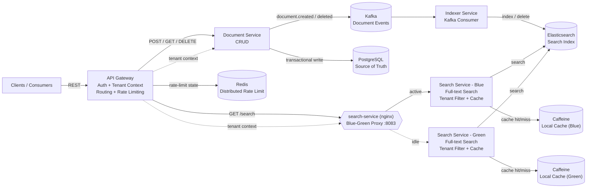
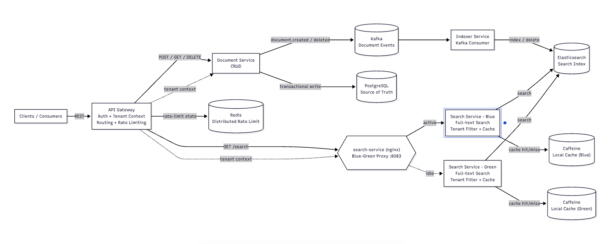
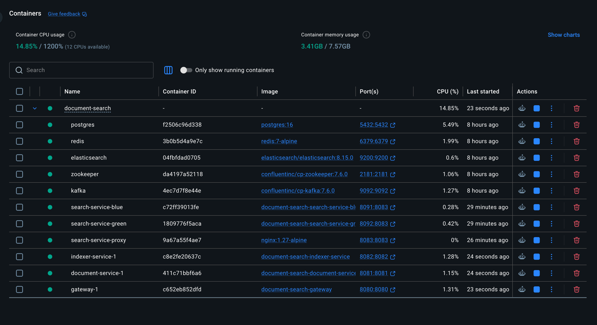

# Distributed Document Search Service

## Technical Assessment – Architecture, Production Readiness & Experience Showcase

**Author:** Khushal  
**Role:** Staff Backend Engineer / Distributed Systems  
**Primary stack:** Java 21, Spring Boot, Spring Cloud Gateway, PostgreSQL, Kafka, Elasticsearch, Redis, Caffeine, Docker
Compose

---

## 1. Executive Summary

This prototype implements a distributed, multi-tenant document search platform designed around the assessment targets of
**10M+ documents**, full-text search with relevance ranking, **sub-500ms p95 search latency**, **1000+ concurrent
searches/sec**, tenant isolation, and horizontal scalability.

The architecture separates responsibilities into independently scalable services:

- **API Gateway** – authentication boundary, tenant context propagation, routing and tenant-level rate limiting.
- **Document Service** – document CRUD and PostgreSQL as the source of truth.
- **Kafka** – asynchronous document-change propagation and buffering between the transactional data path and search
  indexing.
- **Indexer Service** – consumes document events and maintains the Elasticsearch index.
- **Search Service** – tenant-filtered full-text search using Elasticsearch/BM25 with a local Caffeine cache.
- **Redis** – distributed rate-limit state at the gateway.
- **Elasticsearch** – horizontally scalable search/indexing engine.
- **PostgreSQL** – durable system of record.

The prototype deliberately favors **eventual consistency between PostgreSQL and Elasticsearch**. This keeps the write
path reliable and decoupled from indexing latency while allowing search to scale independently.

---

# 2. Architecture Design

## 2.1 High-Level Architecture







Exactly one of `search-service-blue` / `search-service-green` is active (receiving traffic) at a time; the nginx proxy's
`active.conf` decides which, and `scripts/switch-search-color.sh` flips it with zero downtime (see §9.2). The previously
static `img.png` predates the blue-green rollout and is superseded by this diagram.

The gateway establishes the authenticated tenant context. Internal services do **not** trust arbitrary tenant
identifiers supplied by an external client. In the prototype, `X-Tenant-Id` is used for simplicity; in production this
would be derived from a validated JWT/OIDC claim and propagated internally.

Every document read, write, delete, and search operation is tenant-scoped.

---

## 2.2 Component Responsibilities

| Component        | Responsibility                                         | Scaling Model                         |
|------------------|--------------------------------------------------------|---------------------------------------|
| API Gateway      | Authentication, routing, tenant context, rate limiting | Horizontal replicas                   |
| Document Service | CRUD, validation, persistence, event publication       | Horizontal replicas                   |
| PostgreSQL       | Durable document source of truth                       | Read replicas + partitioning/sharding |
| Kafka            | Asynchronous event transport and buffering             | Partitioned cluster                   |
| Indexer Service  | Consume events and update search index                 | Consumer group / horizontal replicas  |
| Elasticsearch    | Full-text search and relevance ranking                 | Shards + replicas                     |
| Search Service   | Query orchestration, tenant filtering, caching         | Horizontal replicas                   |
| Redis            | Shared rate-limit state                                | Redis HA/cluster                      |
| Caffeine         | Low-latency per-instance search cache                  | Local to each search replica          |

---

# 3. Data Flows

## 3.1 Document Indexing Flow

```text
Client
  |
  | POST /documents
  v
API Gateway
  |
  | authenticate + resolve tenant
  v
Document Service
  |
  | validate request
  |
  +----> PostgreSQL
  |       durable document
  |
  +----> Kafka
          document.created
              |
              v
        Indexer Service
              |
              v
        Elasticsearch
          searchable copy
```

The document is first persisted in PostgreSQL. The search index is updated asynchronously through Kafka.

### Why asynchronous indexing?

A synchronous PostgreSQL → Elasticsearch write would increase write latency and couple document availability to
Elasticsearch availability.

With Kafka:

- document writes remain independent of search-index availability;
- Kafka can absorb temporary indexing spikes;
- indexers can be scaled independently;
- failures can be retried;
- consumer lag provides an operational signal.

The trade-off is that a newly created document may not immediately appear in search.

---

## 3.2 Search Flow

```text
Client
  |
  | GET /search?q=distributed systems
  v
API Gateway
  |
  | authenticate + tenant context + rate limit
  v
Search Service
  |
  +----> Caffeine cache
  |         |
  |       HIT ----> return results
  |
  | MISS
  v
Elasticsearch
  |
  | multi_match + tenant filter
  | BM25 relevance score
  v
Search Service
  |
  +----> populate Caffeine
  |
  v
Client
```

The Elasticsearch query combines full-text matching with a mandatory tenant filter.

The tenant filter is implemented as a **keyword field**, allowing exact filtering without analyzing the tenant
identifier.

---

# 4. Storage and Search Strategy

## PostgreSQL – Source of Truth

PostgreSQL stores the authoritative document state.

Reasons:

- ACID transactions for CRUD operations;
- strong durability;
- mature indexing and backup capabilities;
- suitable for metadata and transactional document lifecycle;
- clear ownership of canonical document state.

PostgreSQL is **not** used as the primary search engine because the target workload emphasizes high-volume distributed
full-text search and independent search scaling.

## Elasticsearch – Search Projection

Elasticsearch is used as a derived search projection.

Reasons:

- inverted indexes for efficient full-text search;
- BM25 relevance ranking;
- horizontal scaling using shards and replicas;
- high read throughput;
- native support for text fields and search-oriented indexing.

The prototype uses a mapping where:

- `tenantId` = `keyword`
- `title` = `text`
- `content` = `text`
- `metadata` = object
- timestamps = date fields

## Redis – Distributed Rate Limiting

Redis stores shared gateway rate-limit state.

This prevents a tenant's effective limit from multiplying when gateway replicas are added.

## Caffeine – Local Search Cache

The prototype uses a short-TTL local cache in Search Service.

Cache keys include the tenant identifier and normalized query, preventing cross-tenant cache leakage.

For production, Redis or another distributed cache could be introduced where cross-instance cache sharing is more
valuable than the additional network hop.

---

# 5. API Design

## POST /documents

Creates a document for the authenticated tenant.

```http
POST /documents
X-API-Key: assessment-key
X-Tenant-Id: tenant-001
Content-Type: application/json
```

```json
{
  "title": "Distributed Systems Architecture",
  "content": "Distributed systems use multiple independent services that communicate over a network.",
  "metadata": {
    "category": "technology",
    "author": "Khushal"
  }
}
```

Response:

```json
{
  "id": "e03e56df-30a8-4605-be31-33edfdf93ab7",
  "tenantId": "tenant-001",
  "title": "Distributed Systems Architecture",
  "content": "Distributed systems use multiple independent services that communicate over a network.",
  "metadata": {
    "category": "technology",
    "author": "Khushal"
  }
}
```

## GET /search

```http
GET /search?q=distributed%20systems
X-API-Key: assessment-key
X-Tenant-Id: tenant-001
```

The service performs a tenant-filtered full-text query and returns relevance-ranked results.

## GET /documents/{id}

Retrieves a document only when it belongs to the authenticated tenant.

## DELETE /documents/{id}

Deletes the document from the source of truth and publishes a deletion event so the search projection can be removed.

---

# 6. Consistency Model and Trade-offs

The system intentionally uses **strong consistency for the source of truth** and **eventual consistency for the search
projection**.

### Write path

```text
Client → PostgreSQL → Kafka → Elasticsearch
```

PostgreSQL is authoritative.

### Search path

```text
Client → Elasticsearch
```

Search may temporarily lag behind PostgreSQL while Kafka events are being processed.

### Trade-off

| Choice                        | Benefit                                       | Cost                                      |
|-------------------------------|-----------------------------------------------|-------------------------------------------|
| PostgreSQL as source of truth | Strong durability and transactional semantics | Search requires a separate projection     |
| Kafka asynchronous indexing   | Decoupling and resilience                     | Eventual consistency                      |
| Elasticsearch                 | Fast distributed search                       | Additional operational complexity         |
| Local cache                   | Very low latency                              | Per-instance cache and possible staleness |
| Redis rate limiting           | Consistent limits across replicas             | Network dependency                        |

For this workload, the availability, throughput, and scalability benefits outweigh the small indexing delay.

---

# 7. Multi-Tenancy and Security

Tenant isolation is enforced at multiple layers.

### Request layer

The gateway authenticates the caller and establishes tenant context.

### Application layer

Document Service validates that the requested document belongs to the authenticated tenant.

Search Service always applies a tenant filter.

### Search layer

`tenantId` is mapped as an Elasticsearch `keyword` field and used in an exact filter.

Conceptually:

```text
bool:
  must:
    multi_match:
      fields: [title, content]
      query: <user query>

  filter:
    term:
      tenantId: <authenticated tenant>
```

### Cache layer

Cache keys are tenant-aware:

```text
search:{tenantId}:{normalizedQuery}
```

This prevents a result generated for one tenant from being returned to another tenant.

### Production security

The prototype uses simple API-key/header authentication. Production should use:

- OAuth2/OIDC/JWT;
- tenant identity derived from trusted token claims;
- RBAC/ABAC authorization;
- TLS for external and internal traffic;
- encryption at rest;
- secret management through a cloud secret manager;
- audit logging;
- request validation and payload-size limits;
- protection against query abuse and expensive search expressions.

---

# 8. Rate Limiting and Resilience

Rate limiting is enforced at the API Gateway because it is the common external policy boundary.

Redis stores the token-bucket state so the limit remains consistent across multiple gateway instances.

Example prototype policy:

```text
Document APIs: 100 requests/sec, burst 200
Search APIs:    200 requests/sec, burst 400
```

Search Service should additionally protect Elasticsearch with:

- request timeouts;
- bounded concurrency;
- circuit breakers;
- bulkheads;
- controlled retries;
- connection-pool limits.

Retries should be used selectively. Retrying an already overloaded search cluster can amplify an outage.

---

# 9. Production Readiness Analysis

## 9.1 Scalability – 100x Growth

The target prototype is designed so stateless application services can scale independently.

### Application services

Run multiple replicas of:

- Gateway
- Document Service
- Search Service
- Indexer Service

Use Kubernetes HPA based on a combination of:

- CPU/memory;
- request rate;
- active requests;
- p95/p99 latency;
- Kafka consumer lag;
- Elasticsearch queue/rejection metrics.

### Elasticsearch

For 100x growth:

- increase shard count carefully;
- add replicas for read throughput and availability;
- separate hot/warm storage where appropriate;
- use index lifecycle management;
- optimize mappings;
- avoid unnecessary `_source` fields;
- use aliases for zero-downtime index migration;
- benchmark shard sizing and query fan-out.

Tenant-aware routing or tenant-based partitioning can be considered for very large tenants, but should not be introduced
prematurely because excessive sharding increases operational and query overhead.

### PostgreSQL

For 100x growth:

- connection pooling;
- query/index optimization;
- read replicas for read-heavy workloads;
- table partitioning where lifecycle/data volume justifies it;
- archival strategy;
- eventual sharding by tenant or document ownership if a single cluster becomes insufficient.

### Kafka

Use:

- multiple partitions;
- replication factor >= 3;
- consumer groups;
- producer acknowledgements;
- retry topics / DLQ;
- monitoring of consumer lag.

Partitioning can use tenant/document identifiers depending on ordering requirements.

---

## 9.2 Zero-Downtime Deployments — Blue-Green (Implemented for search-service)

Rather than leaving blue-green as a purely aspirational production item, the prototype implements it for
`search-service`, the component most sensitive to deployment-time disruption (live search traffic).

```text
Gateway --> search-service (nginx :8083) --> search-service-blue  (:8083, host 8091)
                                          \-> search-service-green (:8083, host 8092)
```

- `search-service-blue` and `search-service-green` are two identical containers built from the same image.
- An `nginx` reverse proxy keeps the stable `search-service` hostname/port that `gateway` already targets, so cutovers
  are invisible to upstream configuration.
- The proxy's upstream membership lives in a single bind-mounted file (`nginx/search-service/conf.d/active.conf`);
  switching colors means rewriting that file and running `nginx -s reload`, which nginx performs without dropping
  in-flight connections.
- `scripts/switch-search-color.sh <blue|green>` automates the cutover: it health-checks the target color's
  `/actuator/health` before switching, so a broken deployment never receives traffic.
- Rollback is the same operation in reverse — switch back to the previously active color — so recovery time is bounded
  by how fast the script runs, not by a redeploy.

This is a deliberately minimal, docker-compose-appropriate implementation of the pattern. In production this would be
replaced by a platform-native mechanism (Kubernetes Service/Ingress cutover, an ALB/NLB target-group swap, or a service
mesh traffic split) with automated canary analysis and rollback rather than a manually-invoked script, and would extend
to every stateless service, not just `search-service`.

---

# 10. Resilience

Production failure scenarios and controls:

| Failure                       | Protection                                                                                      |
|-------------------------------|-------------------------------------------------------------------------------------------------|
| Elasticsearch unavailable     | Circuit breaker, timeout, retry policy, cached responses where safe                             |
| Kafka temporarily unavailable | Transactional outbox + retry                                                                    |
| Indexer failure               | Consumer-group restart, retries, DLQ                                                            |
| Poison event                  | DLQ and alerting                                                                                |
| Redis unavailable             | Fail-closed or controlled fallback for rate limiting                                            |
| PostgreSQL failure            | HA deployment, replicas, automated failover                                                     |
| Service instance failure      | Kubernetes health probes + multiple replicas                                                    |
| Zone failure                  | Multi-AZ deployment                                                                             |
| Deployment failure            | Blue-green/canary deployment + rollback (blue-green implemented for `search-service`, see §9.2) |

### Transactional Outbox

The prototype writes to PostgreSQL and publishes Kafka asynchronously. In production, I would introduce a transactional
outbox:

```text
DB Transaction
 ├── document row
 └── outbox event

Outbox Publisher
       |
       v
     Kafka
```

This avoids the classic failure where the database transaction commits successfully but the application crashes before
publishing the Kafka event.

---

# 11. Observability

A production deployment should provide three pillars:

### Metrics

Track:

- request rate;
- p50/p95/p99 latency;
- error rate;
- search result count;
- Elasticsearch query latency;
- cache hit ratio;
- Kafka consumer lag;
- indexing throughput;
- indexing failures;
- database connection-pool utilization;
- rate-limit rejections;
- CPU/memory;
- Elasticsearch shard health.

### Logging

Use structured JSON logs with:

```text
timestamp
service
tenantId
correlationId
requestId
operation
latency
status
errorCode
```

Tenant identifiers must be handled carefully to avoid exposing sensitive information.

### Distributed tracing

Use OpenTelemetry-style trace propagation:

```text
Gateway
  → Search Service
      → Elasticsearch

Gateway
  → Document Service
      → PostgreSQL
      → Kafka
          → Indexer
              → Elasticsearch
```

Correlation IDs make cross-service troubleshooting significantly easier.

---

# 12. Performance Strategy

The primary performance goal is **<500ms p95** search latency.

Key controls:

1. Keep search queries simple and bounded.
2. Use Elasticsearch inverted indexes.
3. Filter by `tenantId` before returning results.
4. Limit result size.
5. Avoid deep pagination; use `search_after` for large result traversal.
6. Cache repeated queries with a short TTL.
7. Keep connection pools appropriately sized.
8. Avoid unbounded retries.
9. Monitor Elasticsearch shard fan-out.
10. Benchmark using realistic document sizes and tenant distributions.

The target should be validated using load testing rather than assumed from local development.

A useful benchmark should measure:

```text
Concurrency: 100 → 250 → 500 → 1000+
Queries/sec
p50
p95
p99
Error rate
Elasticsearch CPU
Elasticsearch heap
Cache hit ratio
```

---

# 13. Operations and Availability

For a 99.95% availability objective, the system should be deployed across multiple availability zones.

Required practices:

- Kubernetes or equivalent orchestration;
- multiple replicas of stateless services;
- readiness and liveness probes;
- rolling/blue-green deployments (blue-green demonstrated for `search-service` in this prototype, see §9.2; production
  would extend the pattern to every stateless service via the orchestration layer);
- automated rollback;
- HA PostgreSQL;
- replicated Kafka;
- Elasticsearch replicas;
- Redis HA;
- automated backups;
- tested restore procedures;
- disaster recovery plan;
- defined RPO/RTO.

**99.95% availability permits approximately 21.9 minutes of downtime per 30-day month**, so operational automation and
failure isolation are important rather than optional.

---

# 14. Code Quality

The implementation is split by responsibility rather than creating a single large service.

```text
common/
gateway/
document-service/
indexer-service/
search-service/
```

Key code-quality principles:

- constructor-based dependency injection;
- DTO/request validation;
- centralized API error handling;
- explicit service boundaries;
- tenant context propagation;
- configuration externalized through environment variables;
- idempotent indexing/deletion;
- health endpoints;
- unit-testable service components.

The prototype intentionally avoids implementing every production concern because the assessment prioritizes
architectural thinking over production-level polish.

---

# 15. Experience Showcase

## 15.1 Similar Distributed System

At Junglee Games, I have worked extensively on Java/Spring-based distributed backend systems involving microservices,
Kafka, Redis, databases, and high-throughput APIs.

One representative area involved decomposing functionality from a monolithic architecture into independently deployable
services such as authentication, user/KYC, device-limit, RAF and leaderboard capabilities. Kafka was used to decouple
services and reduce synchronous dependencies. This architecture improved scalability and allowed individual capabilities
to evolve and scale independently.

In another backend platform, I worked with event-driven flows and distributed data stores where correctness,
idempotency, latency, and failure handling were important design concerns. These experiences directly influenced the
separation of source-of-truth storage, asynchronous indexing, and search-oriented storage in this assessment.

---

## 15.2 Performance Optimization

One example from my experience involved optimizing backend flows where latency and downstream service dependencies were
impacting user-facing performance.

I focused on identifying the critical path, reducing unnecessary synchronous calls, improving data-access patterns, and
moving appropriate work to asynchronous processing. In one area, architectural and service-level improvements
contributed to measurable reductions in operational turnaround and onboarding latency, while a response-time target of
approximately **50ms** was established for latency-sensitive paths.

The key lesson applied here is that performance should be designed around the complete request path rather than
optimizing a single component in isolation.

For this search service, the same principle leads to:

```text
Gateway → Search Service → Cache / Elasticsearch
```

with bounded queries, tenant filtering, and asynchronous indexing rather than putting database operations into the
search critical path.

---

## 15.3 Critical Production Incident

In distributed production systems, one of the most important lessons is that failures often occur at service boundaries
rather than inside a single service.

My incident-handling approach is:

1. Establish the user/business impact.
2. Identify whether the failure is localized or systemic.
3. Check recent deployments/configuration changes.
4. Trace the request across dependent services.
5. Inspect latency, error rate, queues and downstream health.
6. Mitigate first where possible.
7. Restore service before pursuing the complete root cause.
8. Perform RCA and implement preventive controls.

For event-driven systems, this includes checking Kafka lag, consumer health, retry/DLQ behavior, database pressure and
downstream dependencies.

The same operational thinking is reflected in this design through health checks, Kafka buffering, retries, DLQs, circuit
breakers, observability and independent service scaling.

---

## 15.4 Architectural Trade-off

A recurring architectural decision in my work has been deciding between synchronous consistency and asynchronous
scalability.

A fully synchronous architecture can provide immediate consistency but creates tighter coupling and makes downstream
latency part of the user's critical path. An asynchronous/event-driven architecture improves resilience and scalability
but introduces eventual consistency and requires stronger operational controls around retries, ordering, idempotency and
reconciliation.

For this assessment, I deliberately chose:

```text
PostgreSQL = source of truth
Kafka      = asynchronous change propagation
ES         = search projection
```

This is a deliberate trade-off. The system accepts a small indexing delay in exchange for better isolation between
transactional writes and high-volume search workloads.

---

# 16. AI Tool Usage

AI tools were used as an engineering productivity aid, not as a replacement for architectural ownership.

Usage included:

- generating and refining boilerplate Spring Boot components;
- reviewing API and service boundaries;
- exploring Kafka/Elasticsearch integration patterns;
- identifying edge cases around tenant isolation and eventual consistency;
- troubleshooting configuration and dependency issues;
- improving README/documentation structure;
- generating sample API requests and test data;
- reviewing architectural trade-offs and production-readiness gaps.

The final architecture, technology choices, trade-offs, security model, scalability approach, and production
recommendations were reviewed and adapted to the requirements of this assessment.

The prototype was intentionally kept understandable and modular so that each design decision can be explained
independently during a technical discussion.

---

# 17. Key Design Decisions at a Glance

| Decision                              | Rationale                                                                                 |
|---------------------------------------|-------------------------------------------------------------------------------------------|
| PostgreSQL as source of truth         | Durable transactional state                                                               |
| Elasticsearch for search              | Distributed full-text search + relevance ranking                                          |
| Kafka for indexing events             | Decoupling, buffering and independent scaling                                             |
| Caffeine cache                        | Very low latency for repeated searches                                                    |
| Redis rate limiter                    | Consistent tenant limits across gateway replicas                                          |
| Tenant-aware Elasticsearch filter     | Prevent cross-tenant search results                                                       |
| Eventual consistency                  | Better availability and decoupling                                                        |
| Stateless services                    | Easy horizontal scaling                                                                   |
| Gateway as policy boundary            | Centralized authentication/rate limiting                                                  |
| Transactional outbox in production    | Prevent DB/Kafka dual-write inconsistency                                                 |
| Kubernetes in production              | Scaling, health management and zero-downtime deployment                                   |
| Nginx blue-green for `search-service` | Zero-downtime cutover/rollback demonstrated at prototype scale, without a gateway restart |

---

# 18. Assessment Alignment

| Evaluation Area            | How the solution demonstrates it                                                                                       |
|----------------------------|------------------------------------------------------------------------------------------------------------------------|
| **Architectural Thinking** | Clear separation of source of truth, event pipeline and search projection; explicit consistency and scaling trade-offs |
| **Code Quality**           | Modular services, validation, error handling, dependency injection and clear responsibilities                          |
| **Scalability Awareness**  | Kafka partitioning, Elasticsearch shards/replicas, stateless services, HPA and independent scaling                     |
| **Security Mindset**       | Authentication boundary, tenant-aware filtering, cache isolation, authorization and production security controls       |
| **Production Maturity**    | Outbox, retries, DLQ, circuit breakers, observability, HA, backup/restore and deployment strategy                      |
| **Communication**          | Architecture diagram, data flows, API examples, decision tables and explicit assumptions                               |

---

# 19. Assumptions and Prototype Limitations

This submission intentionally distinguishes prototype implementation from production architecture.

### Prototype

- Header-based tenant identification.
- Simple API-key authentication.
- Docker Compose deployment.
- Single-node development dependencies.
- Local Caffeine cache.
- Basic Redis-backed rate limiting.
- Asynchronous Kafka indexing.
- Elasticsearch used as the search projection.
- Blue-green deployment implemented for `search-service` (nginx-based, script-driven cutover — see §9.2), rather than
  only described as a future concern.

### Production

- JWT/OIDC-based authentication.
- Trusted tenant claims and RBAC/ABAC.
- Transactional outbox.
- HA/multi-AZ infrastructure.
- Replicated Kafka, Elasticsearch, PostgreSQL and Redis.
- Distributed tracing and comprehensive SLO monitoring.
- Automated backup/recovery and disaster recovery.
- Load testing and capacity planning.
- Blue-green/canary deployments at the orchestration layer (Kubernetes/service mesh/load-balancer target-group swap)
  with automated canary analysis, extending the manual nginx-based pattern already demonstrated for `search-service` to
  every stateless service.

The assessment explicitly prioritizes architectural thinking and documented assumptions over implementing every
production feature in the prototype.
